# MoodMeal AI

MoodMeal AI is a React web app that suggests food based on how you feel. Pick a mood, browse meal ideas, and see deals on dishes that match your vibe.

## What It Does

- Shows a landing page with mood-based meal suggestions loaded from the Express API
- Includes About, Dashboard, Sign In, and UI component demo screens
- Reusable UI library (Button, Input, Modal, Toast, Loader)
- Dark and light mode with saved preference
- Adapts to phone and desktop screen sizes
- Uses React Router for page navigation
- RESTful Meal API backed by **MongoDB Atlas** for persistent data storage

## Built With

**Frontend**

- [React](https://react.dev/) 18
- [Vite](https://vitejs.dev/) 5
- [React Router](https://reactrouter.com/) 6
- [Tailwind CSS](https://tailwindcss.com/) 3
- [Axios](https://axios-http.com/) for API requests

**Backend**

- [Node.js](https://nodejs.org/) 18+
- [Express](https://expressjs.com/) 4
- [Mongoose](https://mongoosejs.com/) 8 — MongoDB object modelling
- [MongoDB Atlas](https://www.mongodb.com/atlas) — cloud-hosted database

## Why MongoDB Atlas?

MongoDB Atlas was chosen for Week 5 because:

1. **Cloud-hosted & free tier** — no local database installation required. The M0 free cluster is perfect for development and learning.
2. **Schema flexibility** — MongoDB's document model maps naturally to the JSON objects already used by the API.
3. **Mongoose ODM** — provides schema validation, type casting, and a clean query API that integrates seamlessly with Express.
4. **Persistence** — data survives server restarts, unlike the previous JSON file approach.
5. **Scalability** — Atlas scales from a free cluster to a production deployment with zero code changes.

## Database Setup (MongoDB Atlas)

1. Go to [MongoDB Atlas](https://www.mongodb.com/atlas) and sign up or log in.
2. Create a **free M0 cluster** (choose any cloud provider and region).
3. Under **Database Access**, create a database user with a username and password.
4. Under **Network Access**, add your current IP address (or `0.0.0.0/0` for development).
5. Click **Connect** → **Drivers** → copy the connection string.
6. Replace `<username>`, `<password>`, and `<dbname>` in the connection string:

```
mongodb+srv://<username>:<password>@cluster0.xxxxx.mongodb.net/moodmeal?retryWrites=true&w=majority
```

7. Paste the final connection string into `backend/.env` as `MONGO_URI`.

## Setup

You need [Node.js](https://nodejs.org/) 18+ and npm.

```bash
git clone https://github.com/Presktok/mealAi.git
cd mealAi
npm install
cd backend && npm install && cd ..
```

### Environment variables

Copy the example env files and fill in your values:

```bash
cp .env.example .env
cp backend/.env.example backend/.env
```

Then edit `backend/.env` and replace `your_mongodb_connection_string` with your actual Atlas URI.

| File | Variable | Default | Purpose |
| ---- | -------- | ------- | ------- |
| `.env` | `VITE_API_URL` | `http://localhost:5000/api` | Frontend API base URL |
| `backend/.env` | `MONGO_URI` | *(required)* | MongoDB Atlas connection string |
| `backend/.env` | `PORT` | `5000` | Backend server port |
| `backend/.env` | `CORS_ORIGIN` | `http://localhost:5173` | Allowed frontend origin |

> ⚠️ **Never commit your real `.env` file.** It is already listed in `.gitignore`.

## Run the App

Start the backend and frontend in **two terminals**:

**Terminal 1 — API server**

```bash
npm run dev:backend
```

You should see:

```
MongoDB connected: cluster0-shard-00-xx.xxxxx.mongodb.net
MoodMeal API listening on http://localhost:5000
```

The server will not start until the MongoDB connection succeeds.

**Terminal 2 — React app**

```bash
npm run dev
```

Visit [http://localhost:5173](http://localhost:5173).

To open the frontend on your phone over the same Wi-Fi:

```bash
npm run dev -- --host
```

Then open the Network URL from the terminal on your phone.

## Production Build

```bash
npm run build
npm run preview
```

For production, set `VITE_API_URL` to your deployed API URL before building.

## Backend API

Base URL: `http://localhost:5000/api`

| Method | Endpoint | Description |
| ------ | -------- | ----------- |
| GET | `/health` | Health check |
| GET | `/meals` | List all meals |
| GET | `/meals/:id` | Get one meal by id |
| POST | `/meals` | Create a meal |
| PUT | `/meals/:id` | Update a meal |
| DELETE | `/meals/:id` | Delete a meal |
| GET | `/meals/search?q=` | Search meals by title |

### Meal Schema

```
┌──────────────────────────────────────────────────┐
│                     Meal                         │
├──────────────┬───────────┬───────────────────────┤
│ Field        │ Type      │ Constraints           │
├──────────────┼───────────┼───────────────────────┤
│ _id          │ ObjectId  │ auto-generated        │
│ title        │ String    │ required, trimmed     │
│ rating       │ Number    │ required, 0–5         │
│ discount     │ String    │ required, trimmed     │
│ createdAt    │ Date      │ auto (timestamps)     │
│ updatedAt    │ Date      │ auto (timestamps)     │
└──────────────┴───────────┴───────────────────────┘
```

### Example responses

**GET /api/meals** — `200 OK`

```json
{
  "success": true,
  "count": 3,
  "data": [
    {
      "_id": "664f1a2b3c4d5e6f7a8b9c0d",
      "title": "Hyderabadi Chicken Biryani",
      "rating": 4.8,
      "discount": "25%",
      "createdAt": "2025-05-23T10:30:00.000Z",
      "updatedAt": "2025-05-23T10:30:00.000Z"
    }
  ]
}
```

**POST /api/meals** — `201 Created`

```json
{
  "success": true,
  "data": {
    "_id": "664f1a2b3c4d5e6f7a8b9c0e",
    "title": "Mango Lassi",
    "rating": 4.5,
    "discount": "10%",
    "createdAt": "2025-05-23T11:00:00.000Z",
    "updatedAt": "2025-05-23T11:00:00.000Z"
  }
}
```

**Error** — e.g. `404 Not Found`

```json
{
  "success": false,
  "error": "Meal with id 664f1a2b3c4d5e6f7a8b9c0f not found"
}
```

**Error** — e.g. `400 Bad Request` (invalid id format)

```json
{
  "success": false,
  "error": "Invalid _id: abc123"
}
```

### Postman

Import `backend/postman/MoodMeal-API.postman_collection.json` into Postman for sample requests covering every endpoint.

## Database Schema

Below is the generated ER diagram based on the actual Mongoose models in this project (`Meal`, `User`, `Order`):



## Folder Layout

```
moodmeal/
├── backend/
│   ├── config/           # Environment config + MongoDB connection
│   │   ├── index.js      # Centralized config object
│   │   └── db.js         # Mongoose connection helper
│   ├── controllers/      # Request handlers (Mongoose queries)
│   ├── data/             # meals.json (legacy backup, not used at runtime)
│   ├── middleware/        # Error handling (AppError, Mongoose errors)
│   ├── models/           # Mongoose schemas
│   │   └── Meal.js       # Meal model
│   ├── postman/          # Postman collection
│   ├── routes/           # API route definitions
│   ├── utils/            # JSON file helpers (legacy, not used at runtime)
│   ├── server.js         # Express entry point (connects to MongoDB first)
│   └── package.json
├── src/
│   ├── api/              # Axios client and meal service
│   ├── components/
│   │   ├── ui/           # Button, Input, Modal, Toast, Loader
│   │   ├── Navbar.jsx
│   │   ├── Hero.jsx
│   │   ├── Card.jsx
│   │   ├── Footer.jsx
│   │   └── PageLayout.jsx
│   ├── context/          # ThemeContext (dark/light mode)
│   ├── data/             # Static meal data (legacy)
│   ├── pages/            # Home, About, Dashboard, Login, ComponentsDemo
│   ├── App.jsx
│   ├── main.jsx
│   └── index.css
├── index.html
└── vite.config.js
```

## Pages

| URL                | Screen          |
| ------------------ | --------------- |
| `/`                | Home            |
| `/about`           | About           |
| `/dashboard`       | Dashboard       |
| `/login`           | Sign In         |
| `/components-demo` | UI Components   |

## Author

Presktok — [github.com/Presktok/mealAi](https://github.com/Presktok/mealAi)
