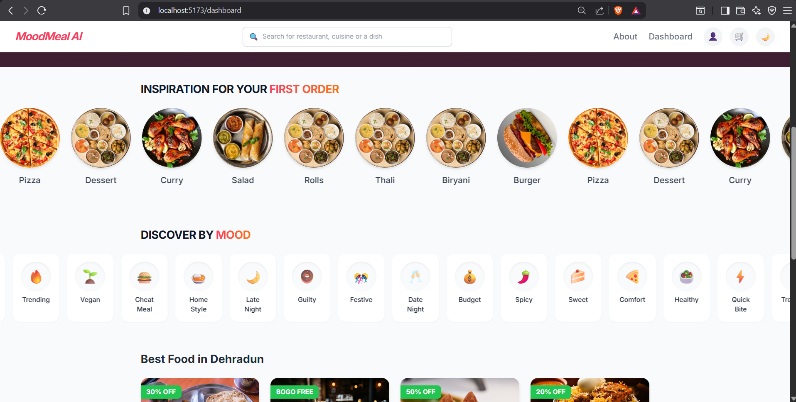
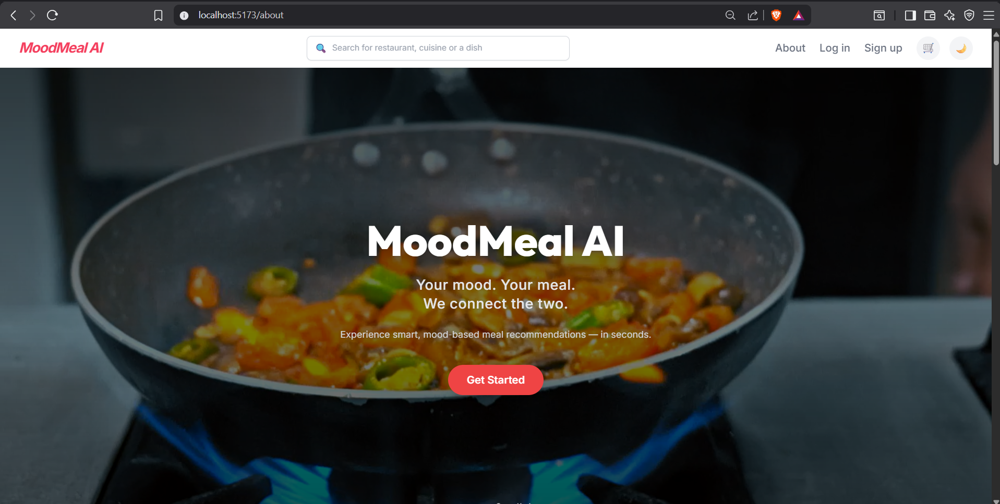
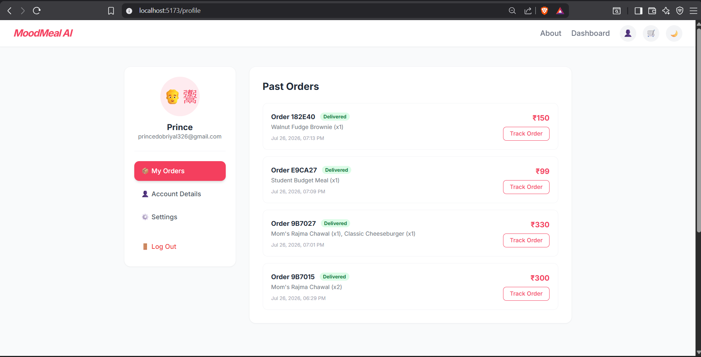
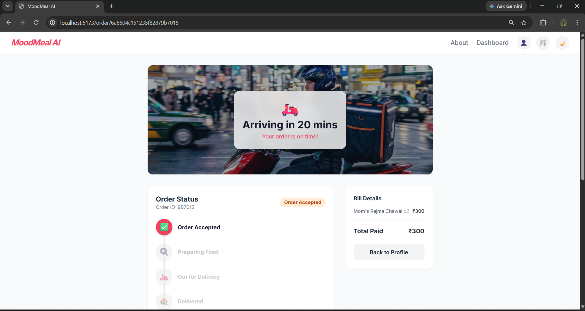

# MoodMeal 🍽️ 

Hey there! Welcome to **MoodMeal**, a React web app I built that basically asks "how are you feeling?" and suggests food based on your vibe. You can pick your mood, browse some tasty meal ideas, and even see deals on dishes that match what you're craving. 

## Screenshots

*(Add your screenshots to the `docs/screenshots/` folder and name them as shown below to make them appear here!)*

| Dashboard | About Page |
| :---: | :---: |
|  |  |

| Profile | Order Tracking |
| :---: | :---: |
|  |  |

| AI Recommendations |
| :---: |
|  |


## What's inside?

- A landing page that pulls mood-based meal suggestions straight from our Express backend.
- A bunch of pages: About, Dashboard, Sign In, and a fun little UI component demo screen.
- A neat, reusable UI library (Buttons, Inputs, Modals, Toasts, Loaders - you name it).
- Dark and light mode (because we all have preferences, and the app actually remembers yours).
- Fully responsive - looks great on your phone or your desktop.
- React Router handling all the page navigation.
- A RESTful Meal API running on Node/Express and hooked up to **MongoDB Atlas** so our data actually sticks around.

## The Stack

**Frontend:**
- [React](https://react.dev/) 18
- [Vite](https://vitejs.dev/) 5 (for that speedy dev experience)
- [React Router](https://reactrouter.com/) 6
- [Tailwind CSS](https://tailwindcss.com/) 3 (styling made easy)
- [Axios](https://axios-http.com/) for hitting the API

**Backend:**
- [Node.js](https://nodejs.org/) (18+)
- [Express](https://expressjs.com/) 4
- [Mongoose](https://mongoosejs.com/) 8 (makes talking to MongoDB way less painful)
- [MongoDB Atlas](https://www.mongodb.com/atlas) (cloud database)

## Why MongoDB Atlas?

Honestly, I went with Atlas for Week 5 for a few reasons:
1. **It's free and in the cloud:** No need to install a database locally. The M0 tier is perfect for messing around and learning.
2. **Flexible:** MongoDB's document model just makes sense when you're already throwing JSON around in the API.
3. **Mongoose is great:** It handles validation, type casting, and keeps the query code clean.
4. **Actual Persistence:** Unlike saving to a JSON file like we did before, the data survives when the server restarts!
5. **Ready to scale:** If this app blows up, Atlas can handle it without rewriting a bunch of code.

## Getting the Database Set Up

If you want to run this yourself, you'll need a MongoDB database:

1. Head over to [MongoDB Atlas](https://www.mongodb.com/atlas) and log in or sign up.
2. Spin up a **free M0 cluster**.
3. Under **Database Access**, create a user (save that username and password!).
4. Under **Network Access**, whitelist your IP (or just use `0.0.0.0/0` if you're just testing locally).
5. Hit **Connect** → **Drivers** and grab your connection string.
6. Swap out `<username>`, `<password>`, and `<dbname>` in the string so it looks something like this:
   `mongodb+srv://<username>:<password>@cluster0.xxxxx.mongodb.net/moodmeal?retryWrites=true&w=majority`
7. Toss that string into `backend/.env` as `MONGO_URI`.

## Running the Project

Make sure you have Node 18+ installed.

First, clone it and grab the dependencies:
```bash
git clone https://github.com/Presktok/mealAi.git
cd mealAi
npm install
cd backend && npm install && cd ..
```

### Environment Variables

Copy the example files so things don't break:
```bash
cp .env.example .env
cp backend/.env.example backend/.env
```
Then, crack open `backend/.env` and paste your MongoDB URI in there.

Here's what the env variables do:
| File | Variable | Default | What it does |
| ---- | -------- | ------- | ------- |
| `.env` | `VITE_API_URL` | `http://localhost:5000/api` | Tells the frontend where the API is |
| `backend/.env` | `MONGO_URI` | *(required)* | Your MongoDB connection string |
| `backend/.env` | `PORT` | `5000` | Port for the backend |
| `backend/.env` | `CORS_ORIGIN` | `http://localhost:5173` | Who is allowed to talk to the API |

> ⚠️ **Quick reminder:** Never commit your real `.env` file! (It's already in the `.gitignore`, but just a heads up).

### Firing it up

You'll need two terminal windows open for this.

**Terminal 1 — The Backend**
```bash
npm run dev:backend
```
If it works, you'll see it say the database is connected and the API is listening. It won't fully start until it talks to MongoDB successfully.

**Terminal 2 — The Frontend**
```bash
npm run dev
```
Then just open [http://localhost:5173](http://localhost:5173) in your browser. 

*(Pro-tip: If you want to check it out on your phone, run `npm run dev -- --host` and use the Network URL it gives you).*

## Building for Production

Ready to ship it?
```bash
npm run build
npm run preview
```
*Just remember to update `VITE_API_URL` to wherever you deploy the backend before building.*

## The API

Base URL: `http://localhost:5000/api`

| Method | Endpoint | What it does |
| ------ | -------- | ----------- |
| GET | `/health` | Check if the server is awake |
| GET | `/meals` | Get a list of all the meals |
| GET | `/meals/:id` | Grab a specific meal |
| POST | `/meals` | Add a new meal |
| PUT | `/meals/:id` | Update an existing meal |
| DELETE | `/meals/:id` | Delete a meal |
| GET | `/meals/search?q=` | Search meals by their title |

### Example Responses

**GET /api/meals** (200 OK)
```json
{
  "success": true,
  "count": 3,
  "data": [
    {
      "_id": "664f1a2b3c4d5e6f7a8b9c0d",
      "title": "Hyderabadi Chicken Biryani",
      "rating": 4.8,
      "discount": "25%",
      "createdAt": "2025-05-23T10:30:00.000Z",
      "updatedAt": "2025-05-23T10:30:00.000Z"
    }
  ]
}
```

Want to test it out? You can import `backend/postman/MoodMeal-API.postman_collection.json` into Postman to get all the sample requests ready to go.

## Database Schema

Here's how the database is structured (based on the Mongoose models for Meal, User, and Order):


## Project Structure

If you're poking around the code, here's where everything lives:

```
moodmeal/
├── backend/            # The Express API
│   ├── config/         # DB connection and env setup
│   ├── controllers/    # The logic for our routes (DB queries live here)
│   ├── middleware/     # Error handling and custom middleware
│   ├── models/         # Mongoose schemas (like Meal.js)
│   ├── postman/        # Collection for testing the API
│   ├── routes/         # API endpoints
│   └── server.js       # The main entry point
├── src/                # The React App
│   ├── api/            # Axios setup and service calls
│   ├── components/     # UI components (buttons, navbars, cards, etc.)
│   ├── context/        # React context (handles the dark mode theme)
│   ├── pages/          # All the main views (Home, About, Dashboard)
│   ├── App.jsx         # App routing
│   └── index.css       # Global styles (Tailwind imports)
└── ...
```

## Where things are

| URL                | What you'll see |
| ------------------ | --------------- |
| `/`                | Home Page       |
| `/about`           | About Page      |
| `/dashboard`       | Dashboard       |
| `/login`           | Sign In / Auth  |
| `/components-demo` | UI Components   |

## Say hi

Built by Presktok — check out the repo at [github.com/Presktok/mealAi](https://github.com/Presktok/mealAi).
